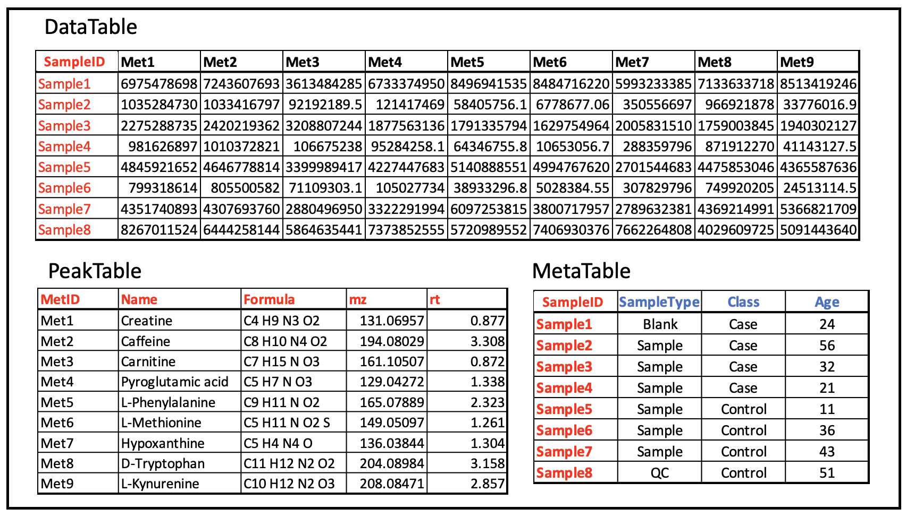
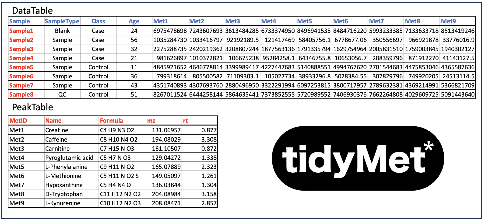
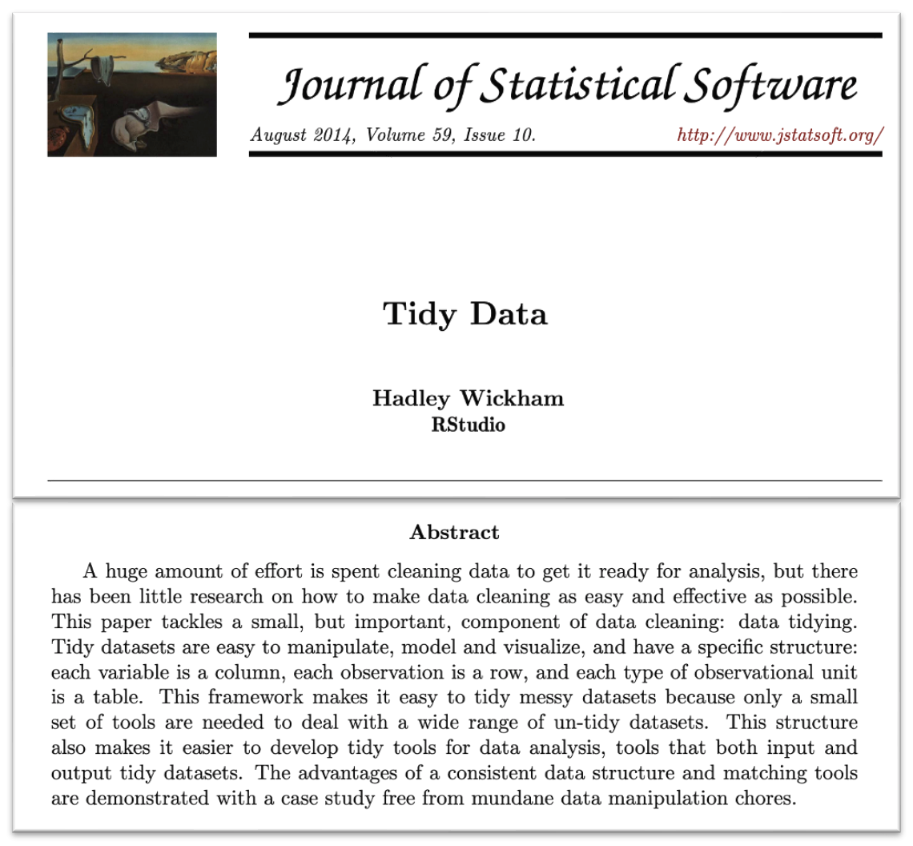

# Metabolomics Data Sharing Protocol
## Introduction
For metabolomics, the starting point for any statistical or machine learning analysis is a data matrix of *S* samples &#215; *M* features, where features are named metabolites, aligned peaks (i.e. generated by XCMS, Compound Discover etc) or similar. Each feature is linked to a set of chemical characteristics (e.g., ID code, full name, mz, retention time, HMDB number, etc.) used for graphical annotation and post-hoc interpretation. Whereas, each sample is linked to experimental and biological meta data (e.g., injection order, batch number, biological class, biological replicate, etc.). 
 
 
A simple way to organise this data is as three linked tables (*DataTable*, *PeakTable*, *MetaTable*), with two sets of ‘keys’ (a *key* is a unique identifier for an entity in the table). One set of keys links the metabolite features to chemical annotations and the other set links samples to sample meta data.

This configuration works reasonably well, but does require the unnecessary overhead of on-the-fly mapping between *DataTable* to the *MetaTable* which is prone to user error. It is much simpler if these two tables are concatenated.

Now there is only one set of *keys* uniquely identifying each feature. All statistical/ML modelling can be performed using a single *DataTable* and mapped to the *PeakTable* for post-hoc tabulation of results (e.g. feature p-values) and visualisation. Using a single *DataTable* also makes it much simpler to slice the data into sub-tables for sub-analysis (e.g. pairwise comparison of sub-populations).
# Tidy Data
When formatting a table that is required to interact with a  computer programming environment (RStudio, Jupyter Notebooks, Matlab) it is best practice to follow the conventions for tidy data set out by [Wickham 2014](https://www.jstatsoft.org/article/view/v059i10).

This requires data tables adhere to the following rules:
1. Every column is a variable.
2. Every row is an observation
3. Every cell is a single value.

# TidyMet
The *TidyMet/** protocol is derived from the Wickham Tidy Data framework. Both the *DataTable* and the *PeakTable* follow the Tidy Data rules. In order to allow programmers to automate mapping between the two tables and basic visualisation the *TidyMet/** protocol enforces a minimal set of required column headers and naming conventions. The *PeakTable* must have a column named *‘UID’*, such that each cell is a unique feature identification code (e.g. Met1, Met2, Met3, ...). Also, *PeakTable* must have a column named ‘Name’, such that each cell contains a text string for naming the *UID* code. The *DataTable* must have a column named ‘SampleID’ such that each cell is a unique sample identification code. Also, there must be a set of columns in the *DataTable* labeled to match the *PeakTable* *UID* cells.
 
 
Additional columns can be informally defined by the user or formally as sub protocols (see *TidyMetqc\** below). One common practice is to add columns of statistical metrics to the *PeakTable*. For example, if a t-test was performed on each feature, comparing two sample populations, the resulting p-value for each comparison could be added into a column labeled *pVal*
# Format
There is no imposed convention for storage of the *DataTable* and *PeakTable* tables; however, they are typically stored as two sheets in an a single Excel spreadsheet or as two .csv files. There are examples [here](\examples).
# Table Interoperability
It is possible for multiple *PeakTable*s to operate with a single *DataTable*, or multiple *DataTable*s to operate with a single *PeakTable*. All that is required is that the *PeakTable* *UID*s are identical to, or a subset of, the corresponding *DataTable* columns. There are examples [here](\examples).
# TidyMetqc\*
The *TidyMetqc\** is specific formatting standard derived from *TidyMet\**. It requires that *DataTable* has columns: 
1. **SampleID** = unique text identifier
2. **SampleType** = one of {‘*Blank*','*QC*','*Reference*','*Sample*’}
3. **Order** = unique sequential number (injection order) 
4. **Batch**  = sequential batch number. 
And *PeakTable* minimally requires 
1. **UID**
2. **Name**

*TidyMetqc\** is the data formatting standard used by [QC-MXP](www.qcmxp.org).